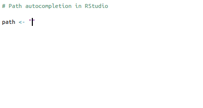

<!-- README.md is generated from README.Rmd. Please edit that file -->

```{r, include = FALSE}
knitr::opts_chunk$set(
  collapse = TRUE,
  comment = "#>",
  fig.path = "man/figures/README-",
  out.width = "100%"
)
```

# path.chain 

<!-- badges: start -->
[](http://krzjoa.github.io/path.chain/)
[](https://travis-ci.org/krzjoa/path.chain)
[](https://ci.appveyor.com/project/krzjoa/path.chain)
[](http://www.redbubble.com/people/krzjoa/works/45140988-path-chain-r-package-hex-sticker?p=sticker&asc=u)
<!-- badges: end -->

> Concise structure for chainable paths

## Installation

``` r
# install.packages("devtools")
devtools::install_github("krzjoa/path.chain")
```
## Example
If you are using RStudio, you know that among many excellent features of this IDE there is a **path autocompletion**.




However, you can also meet situations, when that may be not enough.
Most of all, I mean bigger projects, where you store a complex file structure in the **config** file. 
You can handle such configuration YAML file using the library named [`config`](https://github.com/rstudio/config).
You may encounter a situation, when you'll want to save current directory structure in this config.

```{r config.yml}
library(magrittr)
library(path.chain)

# Create an example file stucture
create_sample_dir(".", name = "files")

# Sample structure we've already created looks as follows
fs::dir_tree("files")

# Loading stucture
file.structure <- create_path_chain("files")
file.structure$data$example1.RData

# Loading stucture with naming convention
file.structure <- create_path_chain("files", naming = naming_k)
file.structure$kData$kExample1

# Saving file structure
file.structure %>% 
  as.list(root.name = "kRoot") %>%
  as_config(wrap = "kDirs") %>%  # Required by `{config}` package
  yaml::write_yaml("config.yaml")
```

```{yaml} 
default:
  kDirs:
    kRoot: files/
    kData:
      kRoot: data/
      kExample1: kExample1
      kExample2: kExample2
      kPersons: kPersons
    kDocs:
      kRoot: docs/
      kSchema: kSchema
```

```{r as_path_chain}
k.dirs <- config::get("kDirs", "default", "config.yaml") %>% 
  as_path_chain()

class(k.dirs)

k.dirs$kData$.
k.dirs$kData$kExample1
```


```{r rm, include=FALSE, results='hide'}
unlink("files", recursive = TRUE)
```
